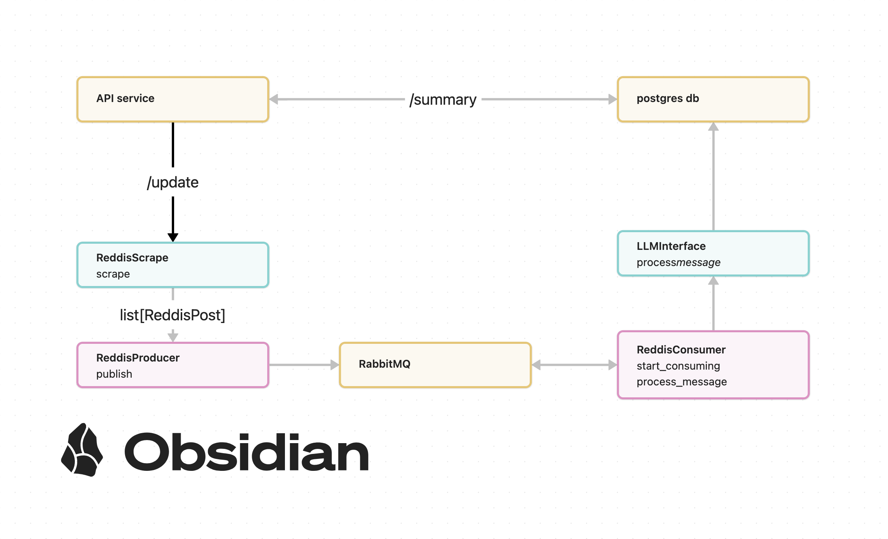

# Reddit Analysis Service

Сервис для анализа постов с Reddit с использованием LLM.


## Основная идея

Сервис позволяет анализировать посты из указанных subreddits с помощью языковой модели. Для каждого поста извлекаются ключевые теги и создается краткое содержание дискуссии под постом.

## Флоу обработки сообщений

1. **API-сервер (Producer)**:
   - Принимает запрос с списком subreddits для анализа
   - Собирает посты через Reddit API
   - Отправляет посты в очередь RabbitMQ

2. **RabbitMQ**:
   - Выступает в роли брокера сообщений

3. **Consumer**:
   - Получает посты из очереди, слушает её
   - Отправляет контент в LLM для анализа
   - Сохраняет результаты в PostgreSQL

4. **База данных**:
   - Хранит оригинальные посты
   - Сохраняет результаты анализа (теги, саммари)
   - Используется для формирования отчетов

## Докер контейнеры

Проект разбит на следующие контейнеры:

1. `api` - FastAPI сервер (producer)
   - Обрабатывает HTTP запросы
   - Взаимодействует с Reddit API
   - Отправляет сообщения в RabbitMQ

2. `consumer` - Обработчик сообщений
   - Читает сообщения из очереди
   - Взаимодействует с LLM
   - Сохраняет результаты в БД

3. `db` - PostgreSQL база данных
   - Хранит посты и результаты анализа
   - Инициализируется через скрипты в `db/init`

4. `rabbit` - RabbitMQ брокер сообщений
   - Управляет очередью сообщений
   - Доступен через management UI

5. `prometheus` - Система мониторинга
   - Собирает метрики с сервисов
   - Хранит временные ряды

6. `grafana` - Визуализация метрик
   - Строит графики и дашборды

## Как запустить

1. Создайте файл `.env` на основе `.env.example`:
```bash
cp .env.example .env
```

3. Заполните переменные окружения в `.env`:
```bash
# Reddit API credentials – получим из developer's space реддита
REDDIT_SECRET="ваш_reddit_secret"
REDDIT_CLIENT_ID="ваш_client_id"
REDDIT_APP_NAME="название_вашего_приложения"

# RabbitMQ
RABBIT_USER="user"
RABBIT_PASSWORD="password"
RABBIT_HOST="rabbit"
RABBIT_PORT=5672
RABBIT_UI_PORT=15672

# PostgreSQL
POSTGRES_DB="reddit_db"
POSTGRES_USER="postgres"
POSTGRES_PASSWORD="postgres"
POSTGRES_HOST="db"
POSTGRES_PORT=5432

# API and monitoring
API_PORT=8000
PROMETHEUS_PORT=9090
GRAFANA_PORT=3000

# LLM settings
LLM_MODEL_NAME="your_model"
LLM_API_KEY="your_api_key"
LLM_BASE_URL="https://api.example.com"
```

4. Запустите сервисы через Docker Compose:
```bash
docker compose up -d
```

После запуска будут доступны:
- API: http://localhost:8000
- RabbitMQ UI: http://localhost:15672
- Grafana: http://localhost:3000
- Prometheus: http://localhost:9090

## Как запустить тесты

1. Создайте виртуальное окружение и установите зависимости:
```bash
python -m venv venv
source venv/bin/activate  # для Linux/MacOS
# или
pip install -r requirements.txt
```

2. Установите переменные окружения для тестов:
```bash
export PYTHONPATH=$(pwd)
export REDDIT_SECRET="test_secret"
export REDDIT_CLIENT_ID="test_client_id"
export REDDIT_APP_NAME="test_app"
```

3. Запустите тесты:
```bash
# Запуск всех тестов
pytest

# Запуск тестов с coverage
pytest --cov=backend --cov-report=term-missing

# Запуск конкретного модуля
pytest tests/api/test_producer.py

# Запуск с подробным выводом
pytest -v
```

## API Endpoints

### POST /update
Запускает процесс анализа постов из указанных subreddits.

Пример запроса:
```json
{
    "subreddits": ["python", "programming"]
}
```

### GET /summary
Возвращает сводку по обработанным постам.
```
# response.json().keys()
dict_keys(['total_processed', 'subreddit_stats', 'latest_update'])
```
### GET /metrics
Endpoint для Prometheus с метриками сервиса.

### GET /health
Проверка работоспособности сервиса.